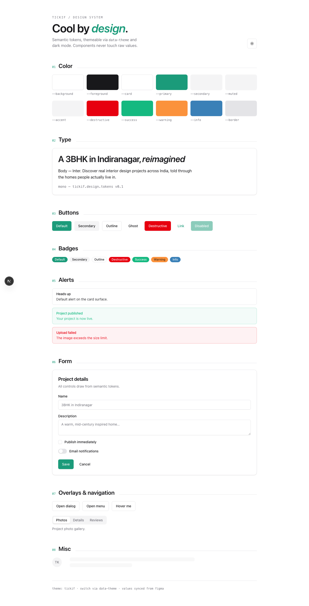
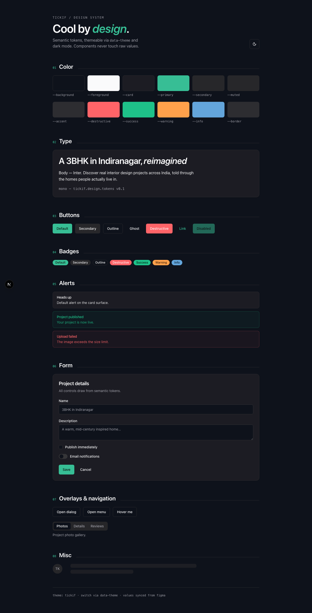

# Tickif

Discovery + portfolio platform for real interior design projects in India.
pnpm + Turborepo monorepo. **Modular monolith** backend (Hono) — clean internal
seams that can be split into services later, not premature microservices.

## Stack

| Layer        | Tech                                                              |
| ------------ | ---------------------------------------------------------------- |
| Frontend     | Next.js 16 (App Router), Tailwind v4, TypeScript                 |
| UI           | `@repo/ui` — token-based design system (Radix + shadcn-style)     |
| Backend API  | Hono (`@hono/node-server`) + `@hono/zod-openapi`                 |
| Auth         | better-auth (Phone OTP + Gmail SSO, admin/organization RBAC)      |
| DB           | PostgreSQL 16 + Drizzle ORM (`casing: snake_case`)               |
| Queue        | BullMQ + Redis (ioredis)                                         |
| API docs     | OpenAPI 3.1 → Scalar at `/docs`                                  |
| Validation   | Zod v4, shared via `@repo/contracts`                            |

## Layout

```
apps/
  web/      Next.js frontend (typed hc<AppType> client)
  api/      Hono modular monolith — src/modules/<domain>/{routes,service,repository}
  worker/   BullMQ workers (media pipeline, indexing)
packages/
  db/         Drizzle client + schema (domain + better-auth tables, one migration set)
  auth/       better-auth instance + plugins
  contracts/  Shared Zod schemas + inferred types (single source of truth FE/BE)
  config/     Zod-validated env loader
  storage/    Cloudflare R2 (S3 API) wrapper — presign, get/put/delete, key builders
  queue/      BullMQ queues + typed enqueue helpers (the API↔worker contract)
  tsconfig/   Shared TS configs
  eslint-config/  Shared flat ESLint config
```

## Design system

[`packages/ui`](./packages/ui/README.md) is a themeable, token-based design system
(Tailwind v4 + Radix, shadcn-style). Components consume **semantic tokens only**
(`bg-primary`, `font-display`, `rounded-lg`) — theme values (colors, fonts, radius)
live in `packages/ui/src/styles/themes/` and are switchable via `data-theme`;
light by default with a dark toggle via `next-themes`. Type: Inter (body) ·
JetBrains Mono (code).

Live showcase of every token and component: **`/design-system`** in the web app.

| Light                                          | Dark                                         |
| ---------------------------------------------- | -------------------------------------------- |
|  |  |

Rules for agents and humans: [`rules/frontend.md`](./rules/frontend.md) — reuse
existing components, create new ones in `@repo/ui` only if missing and reusable.

## Architectural rule (enforced by convention + review)

Dependency direction inside every API module:

- **routes** — the only layer importing Hono. Validates via `@repo/contracts`, delegates to the service.
- **service** — business logic. Imports neither Hono nor Drizzle.
- **repository** — the only layer importing Drizzle.

## Documentation

Full onboarding & reference docs live in [`docs/`](./docs/README.md):

- [Getting Started](./docs/getting-started.md) — run the stack locally
- [Architecture](./docs/architecture.md) — the modular monolith & layering rule
- [Adding a Module](./docs/adding-a-module.md) — the everyday how-to
- [Database & Migrations](./docs/database-and-migrations.md)
- [Auth](./docs/auth.md) · [Conventions](./docs/conventions.md) · [Troubleshooting](./docs/troubleshooting.md)

**AI coding agents:** a single source of truth — [`AGENTS.md`](./AGENTS.md) +
modular [`rules/`](./rules/README.md), read by every tool (Claude Code, Cursor,
Copilot, Codex).

## Getting started

```bash
pnpm install
cp .env.example .env          # set BETTER_AUTH_SECRET (openssl rand -base64 32)
pnpm infra:up                 # Postgres + Redis + MinIO via docker compose
pnpm db:generate && pnpm db:migrate
pnpm dev                      # api :8008, web :3000, worker
```

- API docs (Scalar): http://localhost:8008/docs
- OpenAPI spec: http://localhost:8008/openapi.json
- Web: http://localhost:3000

### Useful scripts

```bash
pnpm typecheck      # turbo: tsc --noEmit across the workspace
pnpm lint           # turbo: eslint
pnpm build          # turbo: build all
pnpm db:studio      # drizzle studio
pnpm --filter @repo/worker enqueue:demo   # prove the queue path
```

## Status

`auth`, `projects`, and the `media` pipeline (direct-to-R2 upload → commit → BullMQ
worker → watermarked webp/avif derivatives) are wired end-to-end. Remaining blueprint
domains (designers, leads, search, billing, reviews, bookings, taxonomy, reports) have
reserved module folders and land in later phases.
