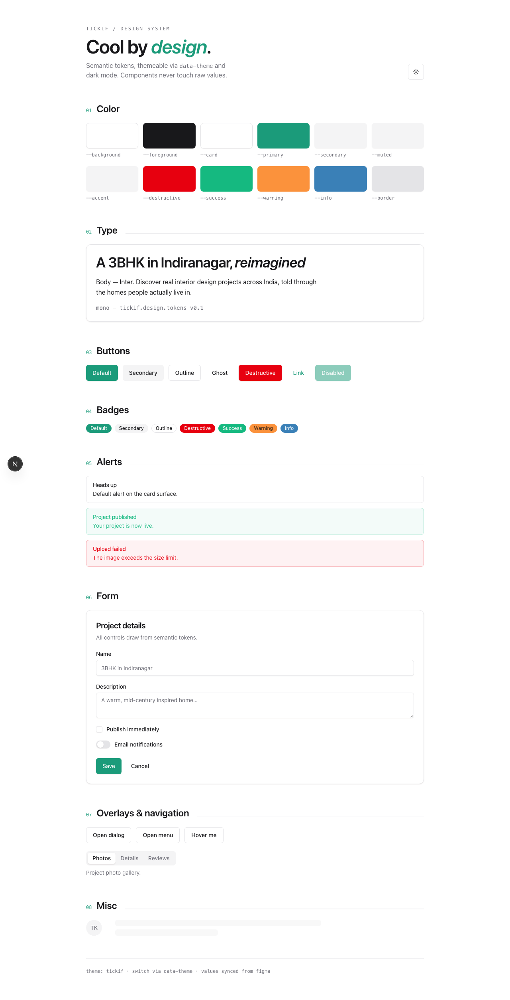
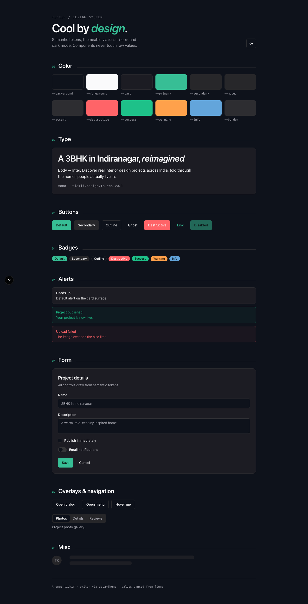

# Tickif

Discovery + portfolio platform for real interior design projects in India.
pnpm + Turborepo monorepo. **Modular monolith** backend (Hono) — clean internal
seams that can be split into services later, not premature microservices.

## Stack

| Layer       | Tech                                                          |
| ----------- | ------------------------------------------------------------- |
| Frontend    | Next.js 16 (App Router), Tailwind v4, TypeScript              |
| UI          | `@repo/ui` — token-based design system (Radix + shadcn-style) |
| Backend API | Hono (`@hono/node-server`) + `@hono/zod-openapi`              |
| Auth        | better-auth (Phone OTP + Gmail SSO, admin/organization RBAC)  |
| DB          | PostgreSQL 16 + Drizzle ORM (`casing: snake_case`)            |
| Queue       | BullMQ + Redis (ioredis)                                      |
| API docs    | OpenAPI 3.1 → Scalar at `/docs`                               |
| Validation  | Zod v4, shared via `@repo/contracts`                          |

## Layout

```
apps/
  web/      Next.js frontend (typed hc<AppType> client)
  api/      Hono modular monolith — src/modules/<domain>/{routes,service,repository}
  worker/   BullMQ workers (media pipeline, indexing)
packages/
  db/         Drizzle client + schema (domain + better-auth tables, one migration set)
  auth/       better-auth instance + plugins
  contracts/  Shared Zod schemas + inferred types (single source of truth FE/BE)
  config/     Zod-validated env loader
  storage/    Cloudflare R2 (S3 API) wrapper — presign, get/put/delete, key builders
  queue/      BullMQ queues + typed enqueue helpers (the API↔worker contract)
  tsconfig/   Shared TS configs
  eslint-config/  Shared flat ESLint config
  search/     Typesense bootstrap, indexing and queries
  billing/    Subscription lifecycle policy
  google-places/  Google Places integration
  logger/     Structured logging and privacy filtering
  telemetry/  OpenTelemetry lifecycle, propagation and metrics
  ui/         Shared components and theme tokens
  vitest-config/  Shared test presets
e2e/          Playwright workspace and isolated full-stack harness
infra/        Provisioning and deployment configuration
docs/         Architecture, coding guidelines, ADRs, guides and runbooks
```

## Design system

[`packages/ui`](./packages/ui/README.md) is a themeable, token-based design system
(Tailwind v4 + Radix, shadcn-style). Components consume **semantic tokens only**
(`bg-primary`, `font-display`, `rounded-lg`) — theme values (colors, fonts, radius)
live in `packages/ui/src/styles/themes/` and are switchable via `data-theme`;
light by default with a dark toggle via `next-themes`. Type: Inter (body) ·
JetBrains Mono (code).

Live showcase of every token and component: **`/design-system`** in the web app.

| Light                                                                        | Dark                                                                       |
| ---------------------------------------------------------------------------- | -------------------------------------------------------------------------- |
|  |  |

Rules for agents and humans: [`docs/coding-guidelines/frontend.md`](./docs/coding-guidelines/frontend.md) — reuse
existing components, create new ones in `@repo/ui` only if missing and reusable.

## Architectural rule (enforced by convention + review)

Dependency direction inside every API module:

- **routes** — the only layer importing Hono. Validates via `@repo/contracts`, delegates to the service.
- **service** — business logic. Imports neither Hono nor Drizzle.
- **repository** — the only layer importing Drizzle.

## Documentation

Start at [the engineering docs](./docs/README.md):

- [Architecture](./docs/architecture/README.md) — system boundaries and domain behavior
- [Coding guidelines](./docs/coding-guidelines/README.md) — enforced engineering conventions
- [ADRs](./docs/adr/README.md) — decisions, consequences and supersession history
- [Getting started](./docs/guides/getting-started.md) — local setup
- [Adding a module](./docs/guides/adding-a-module.md) and
  [testing](./docs/guides/testing.md) — development workflows
- [Runbooks](./docs/runbooks/README.md) — deployment, recovery and operator checks

**AI coding agents:** follow [AGENTS.md](./AGENTS.md) at the start of every job.
Read the architecture overview, ADR index and relevant decisions, plus the
universal and scoped coding guidelines.

## Getting started

```bash
pnpm install
cp .env.example .env          # set BETTER_AUTH_SECRET (openssl rand -base64 32)
pnpm infra:up                 # Postgres + Redis + MinIO via docker compose
pnpm db:migrate
pnpm dev                      # api :8008, web :3000, worker
```

- API docs (Scalar): http://localhost:8008/docs
- OpenAPI spec: http://localhost:8008/openapi.json
- Web: http://localhost:3000

### Useful scripts

```bash
pnpm typecheck      # turbo: tsc --noEmit across the workspace
pnpm lint           # turbo: eslint
pnpm build          # turbo: build all
pnpm db:studio      # drizzle studio
pnpm --filter @repo/worker enqueue:demo   # prove the queue path
```

## Current scope

Projects/media, profiles/portfolios, discovery/search, enquiries/leads, reviews,
billing, organization access, verification and moderation are implemented.
Consultation scheduling is deferred; public actions use enquiries under
[ADR 0003](./docs/adr/0003-consultation-enquiries.md). See the
[architecture overview](./docs/architecture/overview.md) and mounted API routes
for the current system boundaries.
