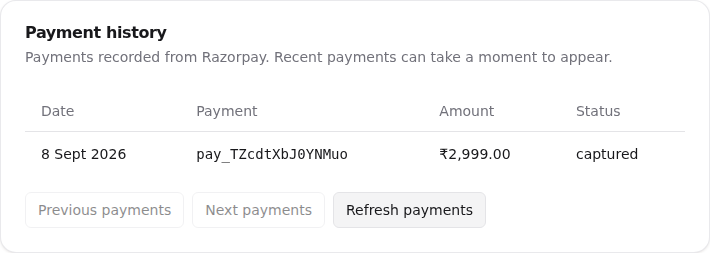
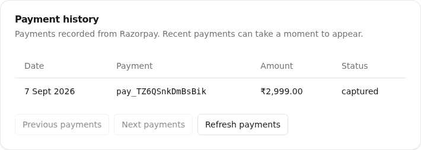

# Billing staging validation

Use a synthetic designer organization and Razorpay **Test Mode**. Staging's webhook and payment-history flow were verified against Razorpay on 8 September 2026; see the E-291 evidence below. This does not certify every scenario in this checklist. Do not use live cards or production keys.

The deterministic suite verifies local PostgreSQL concurrency, authorization, callback signatures, repeated callbacks, cancellation, unchanged-status reconciliation, payment history and UI recovery behavior. `e2e/tests/billing-management.spec.ts` runs real local auth and billing reads with a stubbed Checkout boundary; it does not prove Razorpay connectivity.

1. Configure the staging secret store with `RAZORPAY_KEY_ID`, `RAZORPAY_KEY_SECRET`, `RAZORPAY_WEBHOOK_SECRET` and both paid `RAZORPAY_PLAN_ID_*` values. Use plans from the same Test Mode account. Configure the public API webhook URL `/api/billing/webhook` and the supported subscription/payment events in the Razorpay dashboard.
2. Sign in as the synthetic studio owner. Open Plan & Billing, upgrade Hobby to Professional+, complete the official Test Mode Checkout, and wait for the signed webhook or reconciliation. Confirm the plan stays Hobby if Checkout is dismissed or payment fails. Confirm that retrying the same uncompleted checkout uses the same subscription ID.
3. On a paid plan, choose a different paid plan and confirm the cycle-end change. The current plan must remain unchanged until Razorpay advances to the new plan. Schedule Hobby cancellation and confirm the paid plan stays available to the end date; repeated cancellation must remain idempotent.
4. For an active or pending subscription, choose Update Payment Method. Confirm Razorpay opens against the existing subscription ID with `subscription_card_change`. Complete the Test Mode authorization and check the updated status after refresh. Repeated callbacks must not downgrade a webhook-confirmed active status to authenticated.
5. For a halted subscription, use the same recovery control. Confirm it updates the existing mandate. Historical unpaid invoices can still require support intervention: do not represent updating the mandate as paying every old invoice. Test card/UPI/eMandate behavior supported by this account; the hosted payment-failure email link offers the provider's supported method-switching choices.
6. Verify recorded payments, paise-to-rupee conversion and pagination. The history contains signed-webhook transactions, including failures, and may lag until webhook delivery. It does not fabricate invoices, tax amounts, card details or a payment receipt.
7. In an isolated test webhook setup, pause delivery, allow a paid plan/cycle transition, then refresh. The local tier and period end must reconcile even if Razorpay status remains active. Restore delivery afterward. For an original provider replay, use Razorpay's documented support process; a newly created webhook may not be eligible for older events. Transaction IDs must stay unique. Never disable a shared webhook to isolate one subscription.
8. Try each billing API as an unauthenticated caller and as an organization member without billing permission. Confirm no billing changes, checkout configuration or payment history are available. Simulate API failure: billing should display unavailable/last loaded information, never a fabricated Hobby downgrade.

Sources: [Razorpay payment retries and card changes](https://razorpay.com/docs/payments/subscriptions/payment-retries/), [subscription updates](https://razorpay.com/docs/api/payments/subscriptions/update-subscription/), [Test Mode subscriptions](https://razorpay.com/docs/payments/subscriptions/test/).

The development-only `subscribe-demo` route remains inaccessible in production; all production billing actions use `CheckoutFlow` or the existing-subscription payment recovery flow.

## E-291: verified staging payment history

The active Test Mode webhook `TZcMan7wCDwJ2S` targets
`https://staging.tickif.com/api/billing/webhook`. Readback confirmed these six
events, matching `RAZORPAY_EVENT` in `packages/contracts/src/billing.ts`:

- `subscription.activated`
- `subscription.charged`
- `payment.failed`
- `subscription.pending`
- `subscription.halted`
- `subscription.cancelled`

The older webhook `TVy7gzuF3VVmcN` targeted
`https://e57f-103-191-62-77.ngrok-free.app/api/billing/webhook` and was left
unchanged. The staging endpoint rejected an unsigned probe with 401. A correctly
signed unsupported event returned 200/ignored without changing billing data.

| Check                        | Evidence                                                                               | Result                                                                                                                       |
| ---------------------------- | -------------------------------------------------------------------------------------- | ---------------------------------------------------------------------------------------------------------------------------- |
| Fresh provider delivery      | Real staging Checkout, subscription `sub_TZ7RQwMQ9mBQFK`, payment `pay_TZcdtXbJ0YNMuo` | Razorpay captured INR 299,900 paise; API and rendered history showed one captured ₹2,999 row before operator redelivery.     |
| Duplicate handling           | Two signed operator redeliveries using verified provider entities for that payment     | Both returned 200/duplicate; exactly one payment remained.                                                                   |
| Original missing transaction | Payment `pay_TZ6QSnkDmBsBik`, subscription `sub_TZ6McgaGBZEwGW`                        | Recovery returned 200/processed; repeat returned 200/duplicate. API and UI showed one captured ₹2,999 row dated 7 September. |
| Subscription preservation    | Full subscription response before and after each recovery/duplicate check              | Unchanged, including entitlements, period end and scheduled cancellation.                                                    |

The historical recovery used an **operator-generated** `subscription.charged`
envelope containing payment and subscription entities fetched with authenticated
Razorpay Test Mode API calls. It was signed with the matching webhook secret and
sent through the existing webhook handler. Before sending, the operator verified
captured status, invoice/payment/subscription relationships, organization, amount,
currency and the current local subscription. No direct database insert was used.
This was not a replay of an original provider event. The separate fresh purchase
establishes actual provider delivery; the operator requests establish recovery
and idempotency. Do not reuse this procedure for arbitrary lifecycle events or
production recovery without reviewing their state effects.

The supplied superadmin account had no organization memberships. Its supported
Better Auth impersonation API provided access to the existing test designer
organizations without changing account roles or membership. Verification used
`GET /api/billing/payments?limit=20&offset=0` and `/designer/plan-billing`.

Razorpay CLI 1.0.9 has no webhook/replay command. Original-event replay requires
the [documented Razorpay support process](https://razorpay.com/docs/webhooks/faqs/),
including its event-age and webhook-enablement restrictions. The configuration
was applied through the authenticated provider API. Credentials and sessions are
not included in this repository. No application code change or deployment was
needed to resolve E-291.
