# Billing layout and checkout evidence

Captured on 6–7 October 2026 using synthetic QA organizations. The screenshots
below contain test data. No production purchase or customer data was used.

## Scope

The billing overview shows the current plan, usage, billing summary, plan benefits,
then payment history. Manage Subscription opens the separate comparison page.
Checkout displays a loader while Razorpay is open and returns to a dedicated
closed or confirmation page. Those pages read provider-backed billing state;
the URL or checkout callback alone does not grant paid access.

## Automated workflow coverage

The critical E2E manifest requires all 48 billing journeys to pass without skips.
Playwright runs the real local web, API, auth, database, worker, and reconciliation
code with deterministic doubles only at external provider boundaries.

| Scenario                                                                                    | Evidence / assertions                                                                                                                                               |
| ------------------------------------------------------------------------------------------- | ------------------------------------------------------------------------------------------------------------------------------------------------------------------- |
| All nine current/target plan combinations                                                   | `billing-plan-matrix.spec.ts`, from both overview and comparison entry points                                                                                       |
| Overview and comparison at desktop and phone widths                                         | `billing-management.spec.ts`; one pricing header, aligned actions, no horizontal overflow, plan benefits above payment history, subscription IDs/copy action absent |
| Initial purchase, loader, close, reload, resume, delayed activation, confirmed return       | `billing-checkout-return.spec.ts`, at 1412px and 390px; same provider subscription reused                                                                           |
| Upgrade mandate authorized, adjustment closed, reload, overview resume, captured adjustment | `billing-checkout-return.spec.ts`, at 1412px and 390px; one mandate, one order, one source cancellation; confirmed future renewal mandate shown correctly           |
| Purchase followed by upgrade/downgrade in the same billing cycle                            | `billing-same-cycle.spec.ts`, with and without prior cancellation                                                                                                   |
| Stale/tampered/expired preview, wrong organization/target, permission revocation            | `billing-boundaries.spec.ts`; rejected before provider mutation                                                                                                     |
| Concurrent submissions and operation replay                                                 | `billing-boundaries.spec.ts`; exactly one provider checkout                                                                                                         |
| Outages and lost creation/cancellation/recovery responses                                   | `billing-provider-failures.spec.ts`; no duplicate mutation, uncertain states remain pending                                                                         |
| Invalid, duplicate, stale webhooks; authentication without activation                       | `billing-provider-failures.spec.ts`; paid access cannot be granted prematurely or rolled back                                                                       |
| Pending/halted mandate, scheduled change, saved recovery/session loss                       | `billing-provider-failures.spec.ts` and `billing-management.spec.ts`                                                                                                |
| Return route validation and authorization                                                   | `billing-checkout-result-page.test.tsx`; invalid parameters rejected, live billing permission required                                                              |
| Unknown provider state, cross-organization data, expired checkout, scheduled return         | `checkout-result.test.tsx`; safe pending/error/review states                                                                                                        |

## Actual Razorpay sandbox workflow

The following screenshots were captured from the actual Razorpay SDK in Test
Mode, separately from the deterministic automated tests.

1. Selected Professional+, then closed and resumed checkout without creating
   another subscription.
2. Completed that purchase through Razorpay: ₹2,999 captured.
3. Started a Corporate upgrade. A deliberately invalid sandbox OTP produced the
   provider error below; retry authorized the future renewal mandate.
4. Closed the separate adjustment checkout, then resumed the same order from
   the billing overview. Razorpay captured ₹4,999.40.
5. Verified signed `subscription.authenticated`, `payment.captured`, and
   `subscription.cancelled` webhooks returned HTTP 200 with `processed` results.
   The captured adjustment appeared in local payment history.
6. Scheduled cancellation. Corporate access remained available until
   6 November 2026, with Hobby scheduled after that period.

Both capture statuses were checked against the configured Razorpay Test API.
The first ₹2,999 capture preceded installation of the temporary local webhook;
its historical payment row was not backfilled. History delivery was verified
with the subsequent upgrade capture. The temporary webhook was disabled and
the signed local relay/tunnel stopped after testing. Existing webhooks were
preserved.

The sandbox run does not prove a future bank renewal. Renewal rollover and
scheduled plan-change transitions are covered by deterministic provider evidence
in the automated suite. MCP payment lookup did not expose these test transactions,
so verification used the application's configured sandbox API credentials.

## Local automated results

All 48 billing E2E journeys passed with zero retries and zero skips. The screenshots
below come from that run and the final desktop/mobile evidence rerun; their checkout
provider is a deterministic test double. The actual Razorpay screenshots follow.

### Billing overview and plan comparison

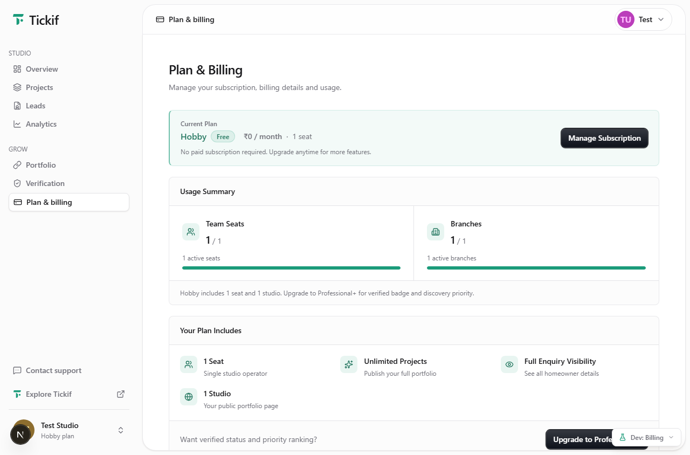

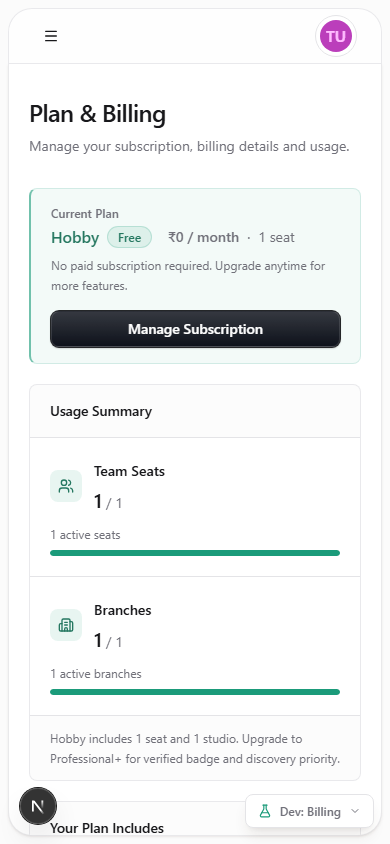

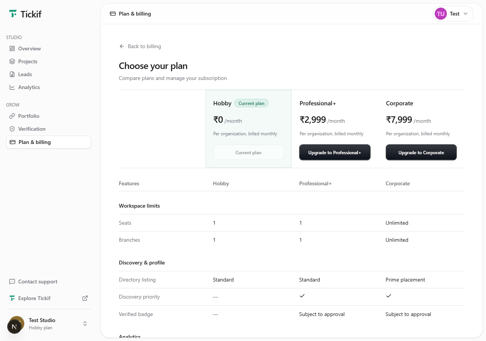

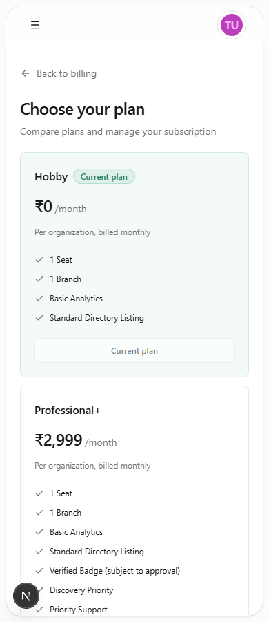

### Loader and delayed confirmation

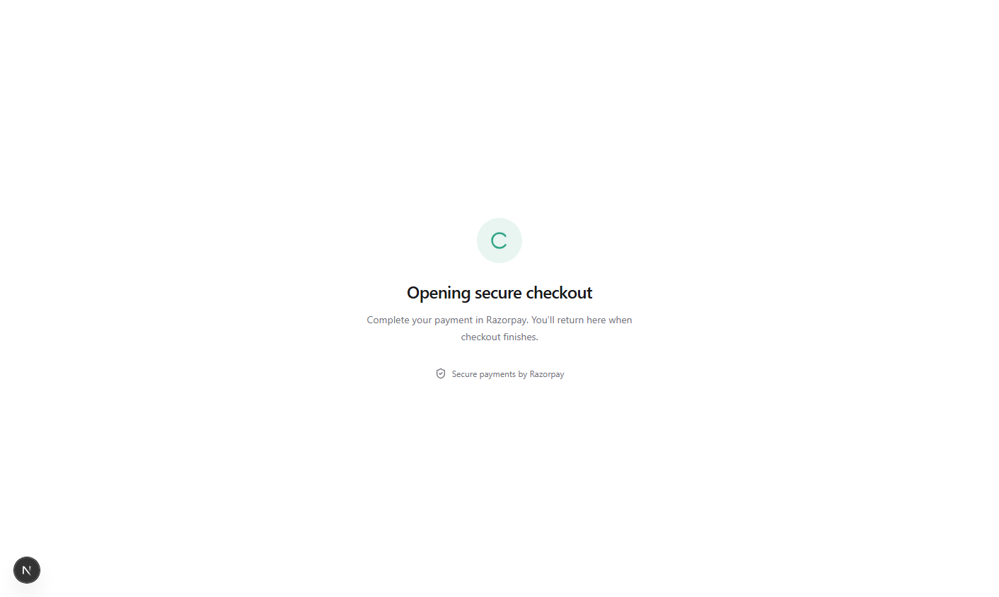

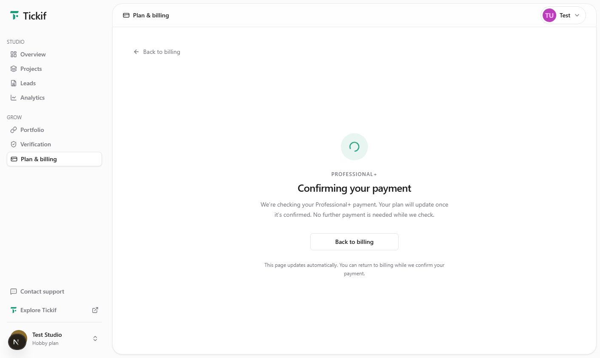

### Upgrade close and resume

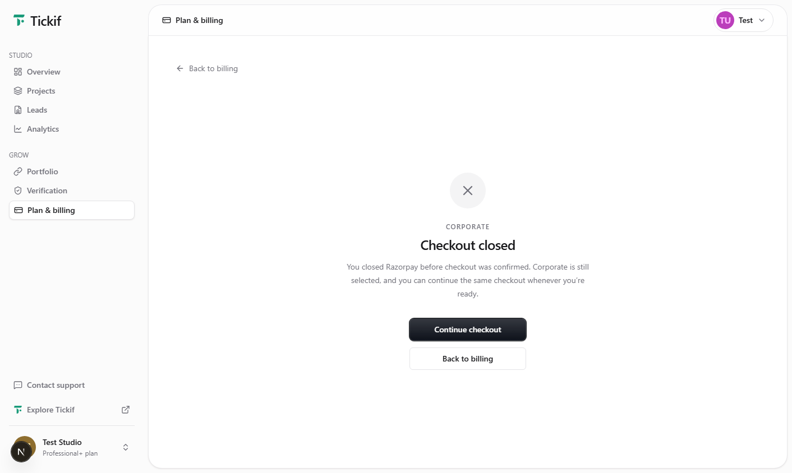

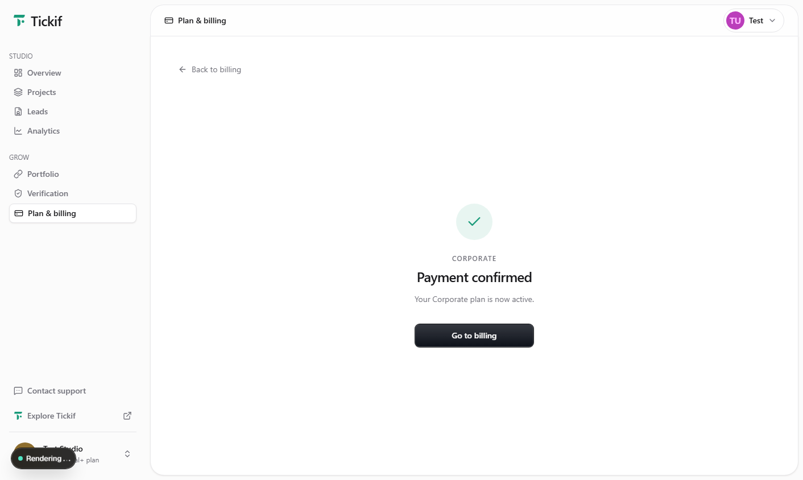

### Plan benefits before payment history

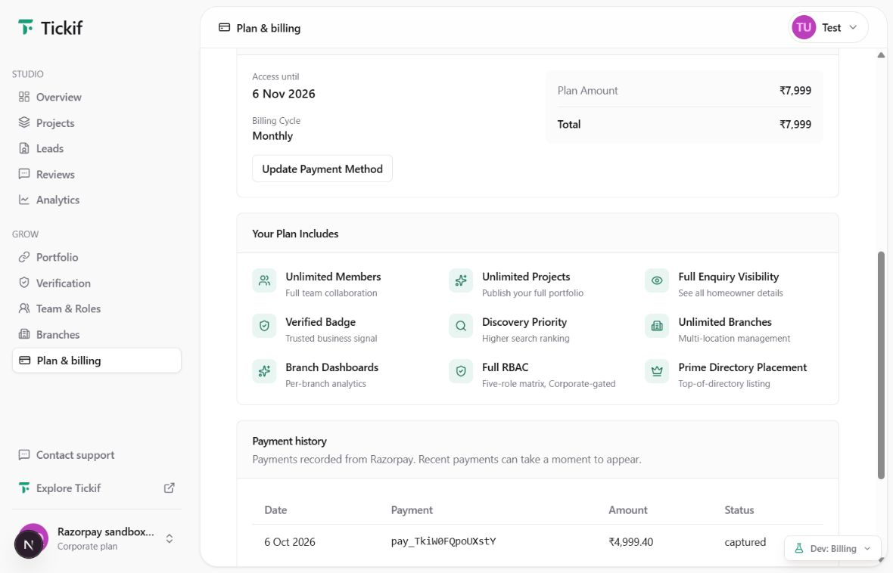

### Actual checkout

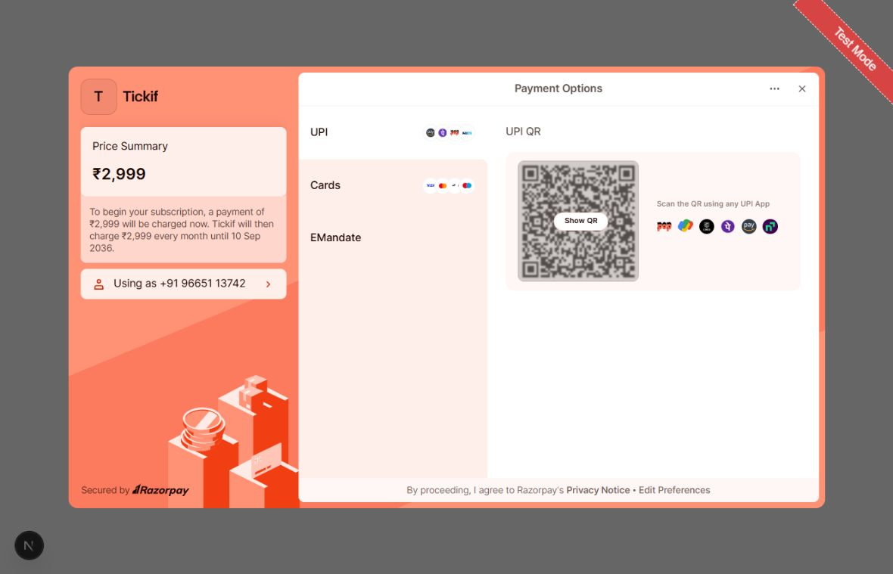

### Closing checkout

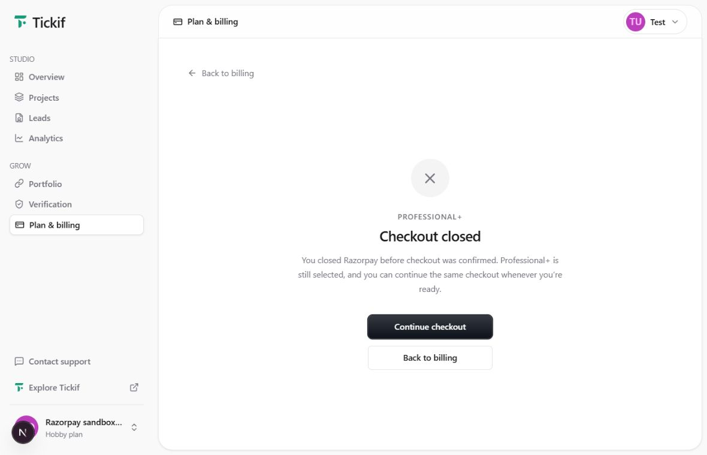

### Provider error and retry

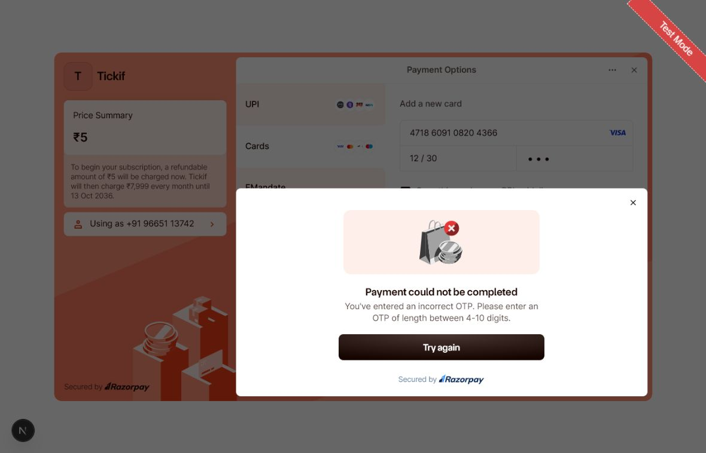

### Confirmed upgrade

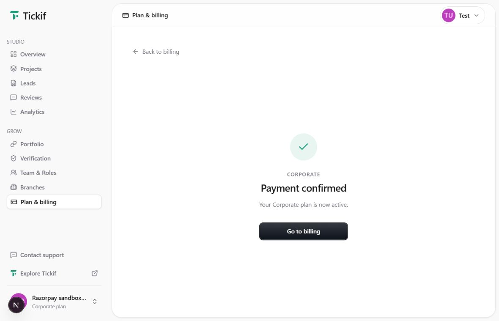

### Captured adjustment in history

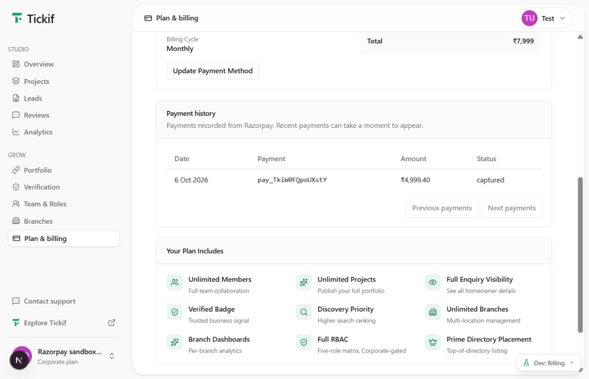

### Scheduled cancellation retains current access

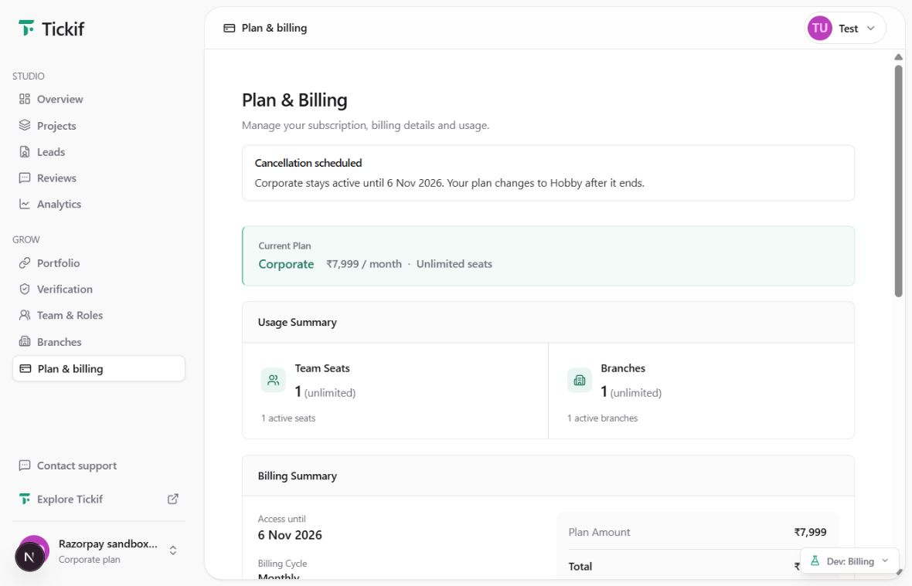
